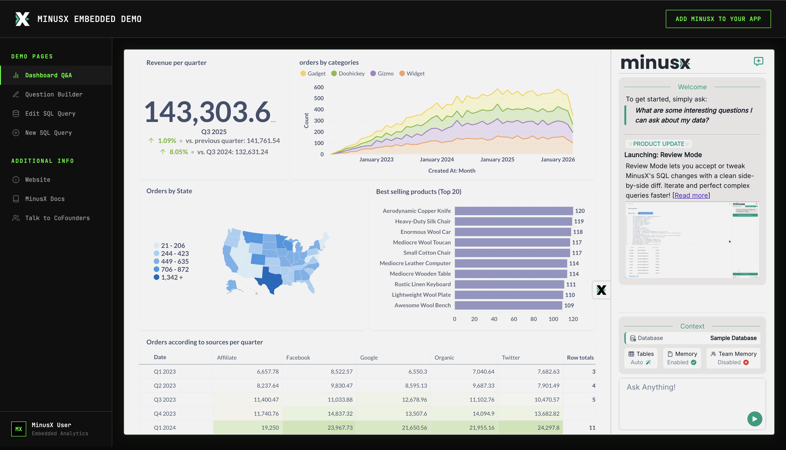
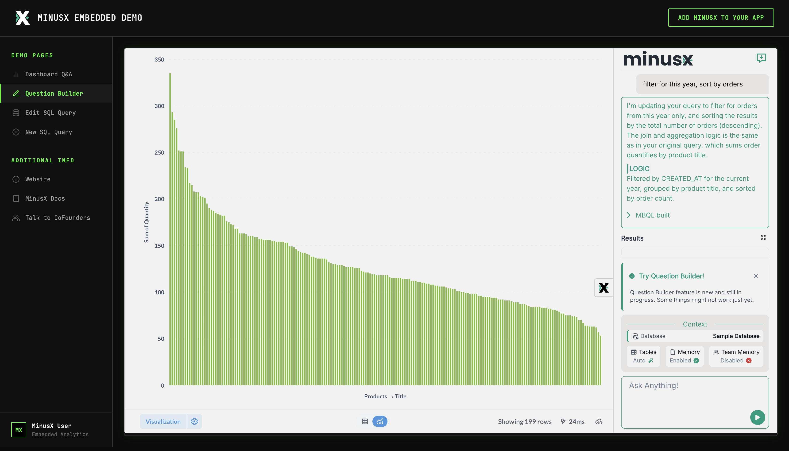

## Embedded Metabase + MinusX Example

> **Live Demo**: [https://embed-demo.minusx.ai](https://embed-demo.minusx.ai)

This repo demonstrates how to add MinusX support to an application that embeds Metabase dashboards and questions. The proxy server handles injecting the MinusX js and custom css into the Metabase iFrame. With that, MinusX just works exactly like it does in the browser extension.




## Setup

Follow these steps to set up and run the embedded Metabase + MinusX application:

### 1. Install Dependencies

Run:

```sh
npm install
```

### 2. Environment Configuration

Create a `.env` file in the root directory with the following variables:

```env
# Metabase Configuration
METABASE_JWT_SHARED_SECRET=your_jwt_shared_secret_here

# MinusX Configuration
MX_JWT_SHARED_SECRET=your_minusx_shared_secret_here

# A dashboard path which you wish to embed. Example: /dashboard/1-e-commerce-insights
METABASE_DASHBOARD_PATH=your_dashboard_path

# An editor path which you wish to embed. Can be sql or mbql Example: /question/139-demo-mbql/notebook
METABASE_EDITOR_PATH=your_editor_path #Example: /question/139-demo-mbql/notebook

# Proxy Configuration
TARGET=https://your-metabase-instance.com
EXTENSION_TARGET=https://web.minusxapi.com/extension-build
EMBED_HOST=http://localhost:9090
```

**Note**: The `MX_JWT_SHARED_SECRET` is required for MinusX authentication. [Contact us](http://minusx.ai/demo) to discuss embedded plans and retrieve this shared JWT token.

### 3. Run Proxy Server
Start the proxy server that handles:
- **a.** Injecting MinusX into Metabase
- **b.** Serving Custom CSS
- **c.** Setting cookie for MinusX on Metabase SSO auth

```sh
npm run proxy
```

### 4. Run Main Server
Start the main application server that:
- **a.** Sets `mx_jwt` along with Metabase JWT using a MinusX shared JWT
- **b.** Handles authentication and UI for your application

```sh
npm run server
```

### 5. Customize CSS (Optional)
Customize the appearance by modifying the `custom.css` file. This file contains styling for the MinusX integration and can be customized with your branding and theming preferences.

You can customize the appearance by modifying the `custom.css` file. This file is served when `/minusx.css` is requested, allowing you to:

- Override default styles
- Define custom CSS variables (like the minusxGreen color palette)
- Apply custom branding and theming

The current `custom.css` includes CSS variables for a custom color palette:

```css
:root {
  --chakra-colors-minusxGreen-50: #ebf8ff;
  --chakra-colors-minusxGreen-100: #bee3f8;
  /* ... more color variables ... */
}
```

## Development Mode

Start the proxy server in MX dev mode to run minusx locally. You'll need a minusx repo in the parent folder and running in dev mode for this to work.

```sh
npm run proxy-mxdev
```

Visit [http://localhost:9090](http://localhost:9090)

## API Endpoints

The application provides the following endpoints:

- **`/analytics`** - Main dashboard view (embeds the configured dashboard path)
- **`/editor`** - Question builder interface (embeds the configured editor path)  
- **`/question?hash=<hash>`** - Direct question viewer (loads `/question#<hash>` from Metabase without authentication)

Example: `http://localhost:9090/question?hash=abc123` will load `http://localhost:9091/question#abc123`

## Architecture

This application consists of two main components that work together to provide MinusX integration with embedded Metabase:

### **server.js** (port 9090) - Main Application Server
The main application server serves as your primary application interface and handles:

- **User Interface**: Provides a custom dashboard UI with sidebar navigation for switching between Metabase dashboards and question builders
- **Session Management**: Manages user sessions with mock user data for development purposes
- **Metabase SSO Authentication**: Generates JWT tokens for Metabase authentication using the `METABASE_JWT_SHARED_SECRET`
- **MinusX Authentication**: Creates MinusX JWT tokens using the `MX_JWT_SHARED_SECRET` for user authentication with MinusX services
- **Dual JWT Handling**: The `/sso/metabase` endpoint creates both Metabase and MinusX JWTs simultaneously, passing them to the proxy server for injection into Metabase

### **proxy.js** (port 9091) - Proxy Server
The proxy server acts as an intelligent middleware between your application and Metabase, handling:

- **MinusX JavaScript Injection**: Automatically injects the MinusX content script (`/contentScript.bundle.js`) into all Metabase HTML pages, enabling the MinusX side panel functionality
- **Custom CSS Serving**: Serves your custom CSS file at `/minusx.css` endpoint, allowing you to customize the MinusX interface appearance and branding
- **MinusX JWT Cookie Setting**: Intercepts `/auth/sso` requests and sets the `mx_jwt` cookie in the browser, which MinusX uses for user authentication
- **Asset Proxying**: Routes MinusX extension assets (JS bundles, CSS, SVG files) either from the production CDN (`web.minusxapi.com`) or from local filesystem in development mode
- **Content Security Policy (CSP) Modification**: Dynamically updates Metabase's CSP headers to allow MinusX frame sources, ensuring the MinusX side panel can load properly
- **Transparent Proxying**: Forwards all other requests to your Metabase instance while intercepting and modifying responses as needed

### Authentication Flow
1. User accesses the main application (server.js)
2. Application redirects to `/sso/metabase` with both Metabase and MinusX JWTs
3. Proxy server intercepts the SSO request and sets the MinusX JWT as a browser cookie
4. Metabase authenticates the user and loads the embedded content
5. Proxy server injects MinusX JavaScript into Metabase pages
6. MinusX initializes using the JWT cookie for authentication, adding the side panel to Metabase
